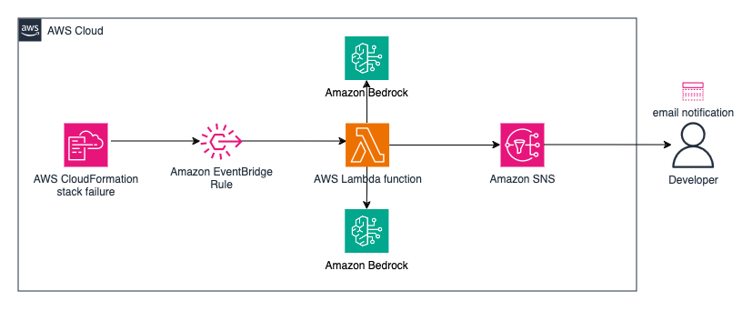

# Troubleshooting CloudFormation Failures with Generative AI



## Overview
This CloudFormation template deploys an AWS Lambda function, an Amazon SNS topic, and an EventBridge rule to help troubleshoot failed CloudFormation stack deployments using Generative AI in Amazon Bedrock with the Anthropic Claude 3 large language models (LLMs). The Lambda function analyzes the failure reason from the CloudFormation event, generates a detailed email response using Claude, and sends the response to the specified email addresses via the SNS topic.

## Prerequisites
Before deploying this CloudFormation template, ensure that you have the following prerequisites set up:

1. AWS CLI: The AWS Command Line Interface (CLI) must be installed and configured on your local machine. You can download and install the AWS CLI from the official AWS documentation: [Installing the AWS CLI](https://aws.amazon.com/cli/)

2. AWS Credentials: Configure your AWS credentials by running aws configure and providing your AWS Access Key ID, Secret Access Key, and preferred AWS Region. Alternatively, you can use other authentication methods like AWS IAM roles or environment variables. For more information, refer to the [AWS CLI Configuration and Credential File Settings documentation](https://docs.aws.amazon.com/cli/latest/userguide/cli-configure-files.html).

3. AWS IAM Permissions: Ensure that you have the necessary permissions to create and manage the required AWS resources (Lambda, SNS, EventBridge, IAM roles, etc.) in your AWS account. You can either have administrative privileges or use an IAM role with the appropriate permissions. See [Policies and permissions in IAM](https://docs.aws.amazon.com/IAM/latest/UserGuide/access_policies.html)

## Purpose
The primary purpose of this tool is to provide a more comprehensive and user-friendly explanation of CloudFormation stack failures. Instead of receiving a generic error message, users will receive a detailed email analysis from Claude, which includes the root cause, reasoning, and suggested steps to resolve the issue.

## Value
By leveraging the power of Generative AI, this tool aims to simplify the troubleshooting process for CloudFormation stack failures. It can save time and effort by providing users with a detailed analysis and actionable steps, ultimately increasing productivity and reducing the time required to resolve issues.

## How it Works
1. An EventBridge rule is created to monitor CloudFormation stack failures in the specified AWS region.
2. When a CloudFormation stack fails, the EventBridge rule triggers the Lambda function.
3. The Lambda function extracts the failure reason from the CloudFormation event and generates a prompt for Claude.
4. Claude analyzes the prompt and generates a detailed email response, including the root cause, reasoning, and suggested steps to resolve the issue.
5. The Lambda function sends the email response to the specified email addresses via the SNS topic.
6. Users receive the detailed email analysis from Claude, which helps them understand and troubleshoot the CloudFormation stack failure more effectively.

## Deployment
To deploy this CloudFormation template, you'll need the AWS CLI installed and configured with appropriate permissions.

1. Clone or download the repository containing the CloudFormation template and cd into the repo's directory.

```bash
git clone https://github.com/labeveryday-cloud-projects/cfn-bedrock-notify.git && cd cfn-bedrock-notify
```

2. Open a terminal or command prompt and navigate to the directory containing the template.
3. Run the following AWS CLI command to create the CloudFormation stack:

```
aws cloudformation create-stack \
--stack-name <STACK_NAME> \
--template-body file://<TEMPLATE_FILE_PATH> \
--parameters \
ParameterKey=EmailAddress,ParameterValue=<YOUR_EMAIL_ADDRESS> \
--capabilities CAPABILITY_NAMED_IAM
```

Replace `<STACK_NAME>` with a name for your CloudFormation stack, `<TEMPLATE_FILE_PATH>` with the path to the CloudFormation template file, and `<YOUR_EMAIL_ADDRESS>` with the email address where you want to receive the analysis.

4. Wait for the CloudFormation stack creation to complete.


### Deploying Across Multiple Regions (Optional)

If you want to deploy this CloudFormation template across multiple AWS regions, you can create a bash script and leverage some AWS CLI commands to create the stack in each desired region. 

Here's how you can do it:

1. Create a bash script (e.g., `deploy-across-regions.sh`) with the following content:

```bash
#!/bin/bash

# List of AWS regions where you want to deploy the stack
regions=("us-east-1" "us-west-1" "eu-west-1")

for region in "${regions[@]}"
do
    echo "Deploying stack in $region region..."
    aws cloudformation create-stack \
        --stack-name <STACK_NAME> \
        --template-body file://<TEMPLATE_FILE_PATH> \
        --parameters \
            ParameterKey=EmailAddress,ParameterValue=<YOUR_EMAIL_ADDRESS> \
            ParameterKey=SecondEmailAddress,ParameterValue=<OPTIONAL_SECOND_EMAIL_ADDRESS> \
        --capabilities CAPABILITY_NAMED_IAM \
        --region $region
done
```

2. Replace `<STACK_NAME>` with the desired name for your CloudFormation stack.
3. Replace `<TEMPLATE_FILE_PATH>` with the path to your CloudFormation template file.
4. Replace `<YOUR_EMAIL_ADDRESS>` with the email address where you want to receive the analysis.
5. Optionally, replace `<OPTIONAL_SECOND_EMAIL_ADDRESS>` with a secondary email address to receive notifications.
6. Update the `regions` array with the list of AWS regions where you want to deploy the stack.
7. Save the script and make it executable with `chmod +x deploy-across-regions.sh`.
8. Run the script with `./deploy-across-regions.sh`.

The script will iterate through the specified regions and create the CloudFormation stack in each region using the provided parameters.

>Note: Make sure you have the appropriate permissions and AWS CLI configured correctly in each region where you're deploying the stack.

## Conclusion
This CloudFormation template provides a powerful tool for troubleshooting CloudFormation stack failures using Generative AI. By combining the capabilities of AWS services like Lambda, SNS, and EventBridge with the advanced natural language processing capabilities of Claude, users can receive detailed and actionable insights into the root causes of failures and suggested resolution steps. This tool can significantly enhance the CloudFormation deployment experience, saving time and effort in the troubleshooting process.

### About me

My passions lie in Network Engineering, Cloud Computing, Automation, and impacting people's lives. I'm fortunate to weave all these elements together in my role as a Developer Advocate. On GitHub, I share my ongoing learning journey and the projects I'm building. Don't hesitate to reach out for a friendly hello or to ask any questions!

My hangouts:
- [LinkedIn](https://www.linkedin.com/in/duanlightfoot/)
- [YouTube](https://www.youtube.com/@LabEveryday)
